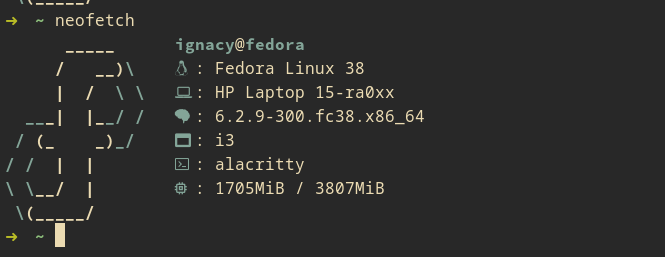

# microfetch

A simple Neofetch theme!
## Preview:

## installation:
First make sure to make a backup of your config:
```bash
cd ~/.config/neofetch/ 
mv config.conf config.backup.conf 
```
Then in the microfetch directory run this:
```bash
curl -o ~/.config/neofetch/config.conf config.conf
```
Also make sure to replace "fedora_small" with your distro's small
